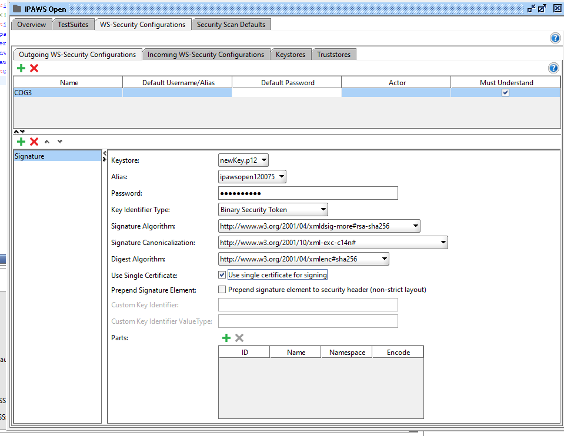

# SoapUI Instructions on how to access IPAWS


## Setting up the key

Go into the keystore directory provided by FEMA in the email sent to Jesus
<br>
Open up a powershell or cmd line window and type the following:
```
keytool -importkeystore -srckeystore IPAWSOPEN120075.jks -destkeystore newKey.p12 -srcstoretype JKS -deststoretype PKCS12 -deststorepass ipawsopen
```
You will be prompted first for the password for the .jks file. Copy/paste the password from the .txt file that's in the same folder. Next you have to copy/paste the private key and then you will see a .p12 file created.
<br>
```
newKey.p12 is the name that I chose for my file but you can choose any name you want
```
```
ipawsopen is the password that I chose for my newKey.p12 file but once again choose any password you like just make sure that your remember it since you'll need it for the SoapUI keystore
```

---
## Setting up SoapUI with a new project for IPAWS

Install soapUI and open it up. Create a new SOAP project by clicking on the soap button in the menu bar. Type in the name of your project and where it says inital WSDL paste this address into the box: https://tdl.integration.aws.fema.gov/IPAWS_CAPService/IPAWS?wsdl

SoapUI is weird with right-click pastes(at least on the windows version) so you will have to do ctrl-v or whatever keys paste on your system. After that click ok.
<br>
You should see a new project in the sidebar that has 3 options if you expand: getMessage, getRequest, and postCap. Open up any of the 3 and each will have a soap template on how they should be formatted. This is important since breaking the format will result in an invalid message.

---
## Adding the security key and header authorization

Double click on the main folder in the sidebar and a new window should open up with 4 tabs on top. Click the WS-Security Configurations tab. Then click the keystores tab underneath. Click the plus(+) button to add a new key. Go to the folder where you saved your .p12 key and choose that key and enter the password the you chose for the key. A new key should appear in the box underneath. The status should read OK if you entered the password correctly. You do not need to enter any information in the default alias or alias password box.

<br>
Next click the tab that says Outgoing WS-Security Configurations. Click the plus(+) button to add a new outgoing WSS Configuration. You don't need to put anything in the default username, default password or alias field but make sure that must understand is checked. 

<br>
Now click the plus button that is underneath the name that you chose to add a new WSS entry. A popup box will appear. Choose the signature option in the box.
Another box will appear. Here's a screenshot of the information that needs to be in the box.



The keystore is the .p12 file that you created so the name might be different and the password is the same password that you chose when you created that file. The other information is also provided on page 11 of the IPAWS-OPEN v4.0 Interface Design Guide (That 111 page one sent in the mail).


After this is setup up you can close the tabs, everything is already saved once it's entered.

---

## Fixing a wsdl error in the endpoint.

You'll notice that each of the three request have a Request 1 under them. Double click on any one of them. See how the address up to starts with an http:// ? That is incorrect due to bad information in the wsdl file. Click the dropdown arrow at the end of the box and choose edit current endpoint. A popup box will appear. Change the http to https. All of the requests will now have the correct endpoint.

---
## Adding the keystore to the requests

On the sidebar near the bottom there's a box underneath the words: **Request Properies** select SSL Keystore in the box and choose your key. The key that you entered earlier should be the only one available. 

<br>
Now we're going to set up the authorization for the getRequest which is the easiest one to setup to test if the certificate is working. Double click the Request 1 under the getRequest. You should see some options on the bottom of the request 1 window. Click the one that says Auth. Selected add new Authorization and choose basic. Under outgoing WSS click on the box and you should see the name you chose on the outgoing WSS option when you setup the security key configurations. Select that name and close the Auth box. Our security configurations should be set up now and we can send a simple getAck message in the next step

---

## Sending your first getRequest

Double click Request 1 under getRequest. Here you only need to put in 3 fields for this to work. You can leave the ? in the other fields. 
```
loginCogId enter 120075
requestAPI enter REQUEST1
requestOperation enter getAck
```

hit the green send button and you should see the reply in the other window. There should be an ACK and PONG if you setup everthing correctly.

If you want to get our team's cog information next you can send another request with the following information:


```
loginCogId enter 120075
requestAPI enter REQUEST1
requestOperation enter getCOGProfile
```

just remember that for both request the information needs to replace the question mark in between the xml tags.

Now you should be good to go to play around with this more. 
You can try to post a cap message by using the template and filling in the fields with the xml information created by our app in the dbs folder. Here you can't leave question marks though and need to delete portions of the soap doc that aren't in the xml. Play around and see what kind of message gets returned. Some will have status numbers returned. What these numbers represent is in Section 13 page 99 of the IPAWS-OPEN v4.0 Interface Design Guide.

Good luck!


